# Clase 1 
Cuando accedemos a informacion a través de internet, esta se encuentra almacenada en una base de datos (generalmente). 

Por un lado tenemos la información, por otro lado tenemos las entidades. Esttas representas cosas u objetos (abstractos  o no), que se diferencian claramente entre sí. 


 


# ¿Qué es una base de datos? 

Una base de datos es una colección de datos generalmente  *almacenados* en una computadora. Usualmente es controlada por gestor de de base de datos (DBMS). En conjunto, todo esto además de las aplicaciones asociadas a ellas son lo que se conocen como un sistema de base de datos, o se reduce sólo a una base de datos. 

### algunos ejemplos 
A lo largo de la historia algunas bases de datos pueden ser: 

Guías telefonicas, archivos personales, Bibliotecas públicas, Registro de transacciones, Historial médico, 
en fín cualquier cosa que lleve un registro de algo (la biblioteca de los libros que hay, los socios, los libros que se llevan los socios, los archivos personales suelen almacenar lso datos por ejemplo de un escritor manteniendo sus escritos originales por fecha a los cuales se les peuden hacer copias, etc) 

Los datos hoy en día, dentro de los tipos más comúnes de bases de datos, se modelan tipicamente en filas y columnas en una serie de tablas para que el procesamiento  y la consulta de datos sea más eficiente. Luego se puede acceder, administrar, modificar, actualizar, controlar y organizar fácilmente los datos. La mayoria de las bases de datos utilizan un lenguaje de consulta estructurado (SQL) para escribir y consultar datos.  

## Ventaja de las bases de datos: 
- Mejora la accesibilidad de los datos: muchos gestores permiten hacer consultas sobre los datos sin una aplicacion para tal tarea. 

- Mejora en la productividad: Al aportarnos muchas de las funcionalidades básicas que necesitamos de un sistema de ficheros permite que nos centremos más en lo requerimientos del usuario. 

- Mejora en el mantenimiento: En la mayoria de los sistemas de ficheros la descripcion de los datos se encuentra en la aplicacion que los maneja. Un gestor de base de datos separa las descripciones de las palicaciones que lo manejan (independencia de datos) gracias a los cuales se simplifica el mantenimiento de las aplicaciones que acceden a la base de datos. 

-Aumento en la ocurrencia: Si varios usuarios pueden acceder al mismo dato al mismo tiempo, es posible que haya perdidas de informacion o integridad. La mayoria de los SGBD gestionan el acceso concurrente para que esto no suceda. 

- Mejora en los servicios de copias de seguridad: Intentan que la perdida de datos durante fallas seaa la minima con copias de seguridad. Esto desde la última copia de seguridad hasta el estado actual antes del fallo. 

## Desventajas de las base de datos: 

- complejidad: Los sistemas gestores de base de datos pueden llegar a ser muy complejos. Por lo que es necesario aprender a usarlos bien. 

- Coste del equipamiento adicional: Para implementar una base de datos probablemente tengamos mas requerimientos de espacio de almacenamiento. Lo que implicaria adquirir un equipo dedicado pura y explusivamente al SGDB. 

- Vulnerable a los fallos: El hecho de que todo esté centralizado en el sistema gestor lo hace mucho más vulnerable a fallos que puedan producirse. Por ello suelen tenerse copias de seguridad. 

## Diferencia entre una base de datos y una hoja de calculo: 

Ambas se usan para almacenar informacion. Sus principales diferencias son: 

- Como se almacenan y manipulan los datos 
- Quién puede acceder a los datos 
- Cuántos datos se pueden almacenar 

Originalmente las hojas de calculos se diseñaron para un usuario. Son muy buenas para un numero pequeño de usuario que necesitan almacenar y manipular datos no tan complejos. En cambio las bases de datos se usan para almacenar colecciones mucho más grandes de datos organizados. Y además permiten que muchos usuarios al mismo tiempo acceder y consultar los datos  deforma rápida y segura usando un lenguaje complejo. 

## tipos de base de datos: 

Hay muchos tipos de estas y la mejor depende en como planeemos organizar y utilizar los datos. 

-Base de datos relacionales: Los elementos de estas tablas se organizan como un conjunto de tablas con columas y filas. Proporcionan la manera más eficiente de acceder a informacion estructurada. 

- Base de datos orientada a objetos: La informacion se representa como objetos, como en la programacion orientada a objetos. 

- Base de datos distribuidas: consta de dos o más archivos ubicados en distintos sitios. (en distintas computadoras o dispersas a través de redes)

- Almacen de datos: Es una base de datos diseñada para consulta y analisis de datos rápidamente. Funciona como deposito central de datos. 

- NoSql: O base de datos no relacional, permite que los datos *no estructurados y semi estructurados* se almacenen y manipulen, a diferencia de una base de datos relacional que define como deben componerse todos los datos insertados en la base de datos.  
- Bases de datos orientadas a grafos. Una base de datos orientada a grafos almacena datos en  términos de entidades y las relaciones entre entidades. 
- Bases de datos OLTP. Una base de datos OLTP es una base de datos analítica y rápida diseñada para un gran número de transacciones realizadas por múltiples usuarios. 

## Tipos de *clientes* de bases de datos 

- Cliente **C**ommand **L**ine **I**nterface: Es un cliente que interactua con la base de datos mediante la consola. 

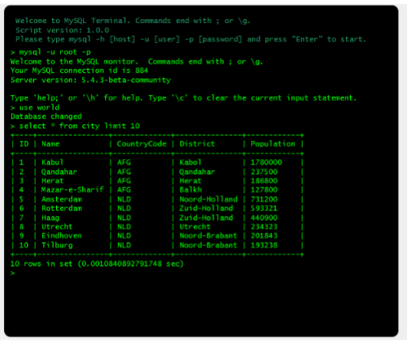 

- Ciente **G**raphical **U**ser **I**nterfaces: Es un cliente que interactua con la base de datos mediante el uso de una aplicacion gráfica. 

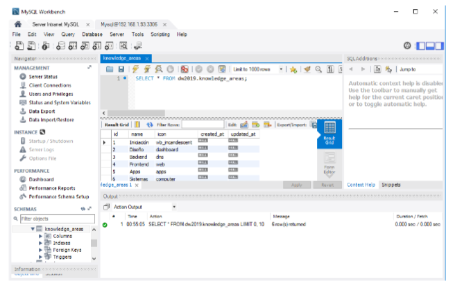 

- **Cliente Web**: Es un cliente que interactúa con la base de datos a través de una página web mediante el uso de un navegador 

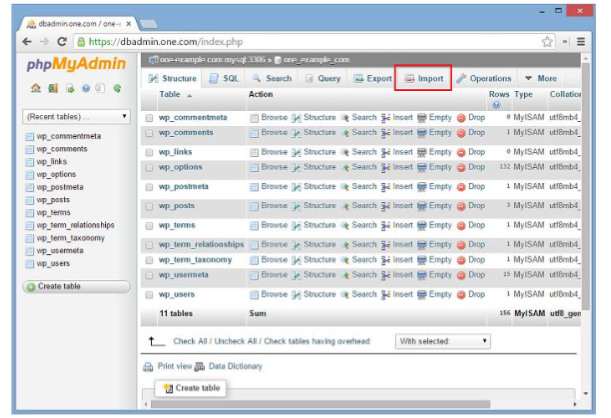 

## ¿Qué es el software de base de datos? 

Se utiliza para crear, editar y mantener archivos y registros. Facilita la creacion de estos, la entrada, la edición, las actualizaciones y los informes de datos. Este software también se encarga del almacenamiento de datos, de la seguridad y el control de acceso múltiple. A menudo se los denomina como "sistema de administracion de base de datos"(DBMS). 

El software de base de datos simplifica la gestión de la información al permitirles a los usuarios 
almacenar datos en una forma estructurada y luego, acceder a ellos. 

## ¿Qué es un sistema de administracion de base de datos (DBSM)? 

Una base de datos generalmente requiere de software para ser admnistrada. Este sirve como interfaz entre la base de datos y sus usuario o programas finales, lo que les permite recuperar, actualizar y adminitrar como se organiza la información. Un DBSM también facilita una variedad de operaicones administrativas, como la supervisión del rendimiento, el ajuste, las copias de seguridad y la recuperación.  

Algunos ejemplos de DBSM pueden ser: 
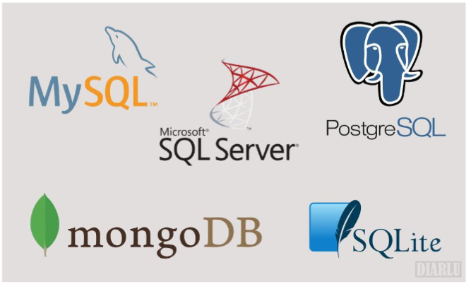 

# ¿Qué es *MySql*? 

Es un *sistema de gestión de base de datos relaciones* (de código abierto) basado en **SQL**. Fue *diseñado y optimizado* para aplicaciones web y puede ejecutarse en cualquier plataforma. Por eso está diseñado para procesar millones de consultas y miles de transacciones. Su flexibilidad bajo demanda es una de sus principales caracterisiticas (suele ser elegido por empresas de comercio electronico que necesitan procesar multiples transferencias de dinero). 

Con la cantidad de datos recompilados de los usuarios las empresas ahora van más allá de almacenar información básica y las transacciones para poder analizar grandes cantidades de datos de múltiples sistemas. Los cuales permiten tomar desiciones de manera más eficiente, volverse más agiles y escalables. 

Y al ser la base de datos independiente y automatizan procesos manuelos costosos y prolongados, permite que los usuarios sean más proactivos con sus datos. Al tener control directo sobre la capacidad de crear y usar base de datos ganamos control y autonomia a la vez que mantenemos importantes estandares de seguridad. 

**Carecterisiticas:** 

- Es gratuito: Al ser de código abierto, aunque tambien hay una version de pago proporcionada por oracle. 

- Es multiplataforma: Puede ser usada en Solaris, FreeBSD, Linux, MacOS y windows.  

- Interfáz gráfica: Si bien puede ser usada mediante consola, también aporta varias interfaces graficas como MySQL Workbench, PHPMyAdmin entre otros. 

- Motores: Es compatible con varios motores de almacenamiento, pero se suelen usar dos: *InnoDB* y *MyISAM*. 

- Respaldo: por defecto viene con un sistema de respaldo de base de datos llamado *mysqldump*. Esta herramienta crea una copia compimida de la base de datos que peude ser usada para restaruar la original en caso de perdidas o fallos. 

- Arquitectura multihilo: gracias a esta, mysql permite que varios usuario puedan acceder a los datos almacenados de manera simultanea. 

- Privilegios: Para acceder a la base de datos, y escribir, ver, borrar o modificar el contenido de las mismas se requiere ciertos privilegios. En MySql podemos crear usuarios y darle algun privilegio segun lo que querramos que pueda hacer. 

 
# ¿Qué es un lenguaje de consulta estructurado? 

**S**structure **Q**query **L**anguage es unlenguaje de programación usado por casi todas las bases de datos relacionales para consultar, manipular y definir datos. También para controlar el acceso. Nacio en 1970 por IBM con Oracle como uno de ls principales contribuyentes, lo que llevó a la implementacion del estandar *ANSI* de SQL. (AUnque todavia puede mejorar y se usa ampliamente, empizan a aparecer nuevos lenguajes) 

SQL se usa por los administradores, por los desarrolladores y por los analistas de datos. Sus usos incluyen modificar la esrtuctura de tablas e indices de las DB, actualizar y eliminar filas de datos; y también al recuperación de subconjuntos de información de una base de datos para el procesamiento de transacciones y aplicaciones. 

Las consultas y otras operaciones adoptan la forma de comandos escritos como sentencias. Las sentencias más usadas son *select*, *add*, *insert*, *update*, *delete*, *create*, *alter* y *trucate*. 

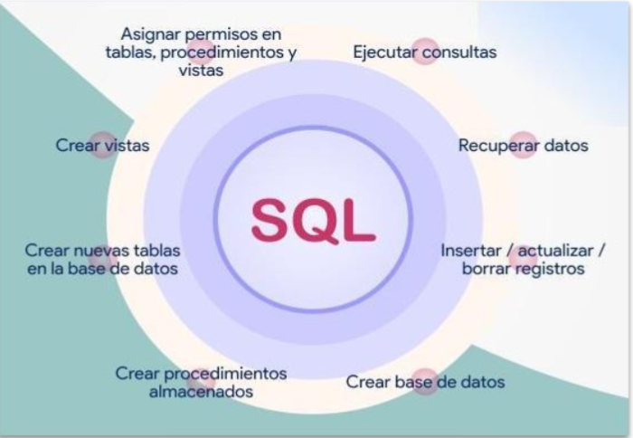

# Modelo entidad Relacion 

Es un modelo para diseñar base de datos, se representa por un diagrama y esta conformado por varios elementos, de los cuales el principal es la entidad. El tipo de diagrama que usamos se llama **DER** (Diagrama Entidad Relacion), el cual pertence al lenguaje de modelado universal[(UML - Universal Modeling Language)](https://miro.com/es/diagrama/que-es-diagrama-uml/) 

Se define a entidad como una unidad de una base de datos que contiene informacion. Esta unidad es una representacion de un objeto (persona, empresa, etc) que puede ser real o abstracto, y como tal posee ciertos atributos que la diferencian del resto de entidades. Así por ejemplo, en una base de datos de un establecimiento educativo, una entidad podría ser `alumnos`, otra las `materias`, los `profesores`, etc. Cada una de estas entidades tendría atributos propios (por ejemplo los alumnos podrían tener atributos como nombre, edad, apellido). 

## Entidades 

Los atributos definen o identifican las carécteristicas propias *y por lo general* únicas de una entidad. 

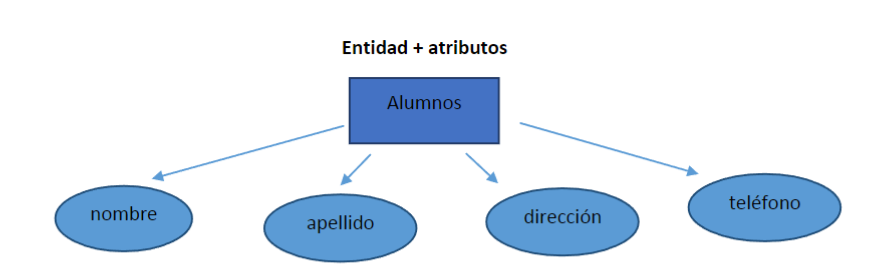 

En una base de datos compleja puede existir entidades relacionadas entre sí por diversos parámetros o atributos, de modo que la existencia de una puede ir ligada a la existencia de la otra. Así las entidades pueden ser fuertes (existen por sí mismas) o débiles (su existencia depende de que exista otra entidad). Las relaciones entre entidades suelen describirse en el esquema de la estructura de la base de datos e incluso pueden agruparse entre sí para formar un conjunto de entidades. 

El modelo entidad-relacion es uno de lo más importante a la hora de diseñar e implementar una base de datos con éxito. Mediante este modelo se relacionan una o varias entidades por sus atributos. Que pueden ser comúnes o no a varias de ellas. (Por ejempl DNI) 

Las relaciones tienen una carecteristica importante denominada "cardinalidad", la cuál indica el sentido y la cantidad de "relaciones" existentes entre entre una entidad y otra. (Recodemos que las relaciones dependen  de los atributos) 

**Relacion uno a muchos (1-n):** 

En el siguiente ejemplo se ve que un alumno puede tener muchos autos(n) y a su vez muchos alumnos pueden ser de un alumno. 

 

**Relacion uno a uno(1-1):** 

Un alumno puede tener una libreta y esa libreta puede pertenecer a un únco alumno. 

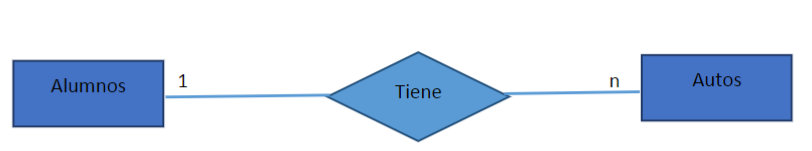 

**Relación muchos a muchos:** 
En el siguiente ejemplo se ve que un alumno puede estar asignado a muchas materias, y las materias pueden tener muchos alumnos 

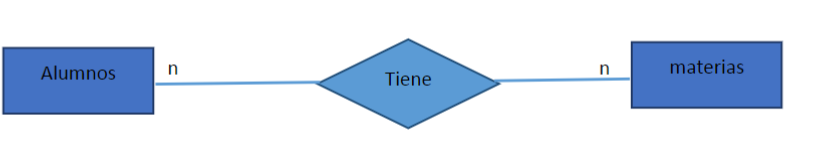 

El siguiente diagrama permite entender de forma rápida y sencilla toda las tablas de nuestra base de datos. 

 

## Diagrama fisico (tablas, campos y registros) 

Una tabla es una colección de datos con la misma estructura. Si se disponen los datos en una columna, esa columna siempre tiene el mismo tipo de datos, por ejemplo, un número de documento, un nombre, etc. 

Podemos decir que cada tabla es una entidad , de un cierto numero de campos, en cada uno de los cuales se guarda un dato, que puede ser numérico, alfanumérico, fecha, etc. 

Un *campo* es cada una de las columnas de la tabla y el nombre de la columna es el nombre del campo, es decir, un campo es un atributo. 

Un *registro* es cada una de las filas de la tabla, y está formada por el dato de cada uno de los campos almacenados en una misma operación. 

[ejemplo columna-registro](img/ejemplo-columna-registro.PNG) 

# Tipos de Datos en MySQL 

Conocerlos nos ayudan a defibir el tipo de datos según nos convenga para ahorrar espacio para cada atributo de una tabla. Estos pueden ser: 

- Numéricos 
- Alfanuméricos 
- Fechas y horas 

A su vez, tenemos distintas opciones para cada opcion. Por ejemplo: 

## **Numericos**:

### *Enteros*: edades, cantidades, magnitudes sin decimales etc. 

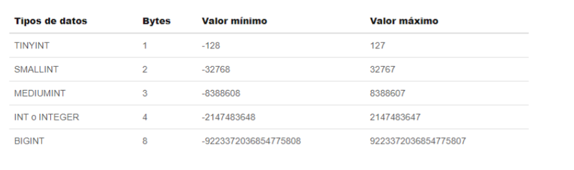 

*valores sin signos*: En estos casos podemos encontrar ejemplos dónde no tiene sentido almacenar valores en negativo (como edad) por lo que si eliminamos la posisibilidad de que se puedan almacenar, duplicamos su capacidad, puediendo hacer que tinyint pase de guardar valores desde -128 hasta 127 pase a almacenar desde 0 hasta 255. 

[tipos de enteros positivos](img/type_int2.PNG) 

### *Decimales*: precios, salarios, saldo en cuentas bancarias, etc. 

En esta categoria de numéricos hay 3 tipos de decimales 

- Float: Permite almacenar como minimo *-999.99* y como máximo *999.99*. En total son 6 digitos, de los cuales, 1 es la coma y 2 son decimales. La cantidad de decimales debe estar entre 0 y 24, ya que esta es la presición simple. 

- Double: Estos al ser de doble presicion permiten que la cantidad de decimales se defina entre 25 y 53. 

Los calculos entre campos se usan con Double, ya que es la de mayor presicion, por lo que el uso de Float puede traer perdida de valores. 

- Decimal: Esta es la más utilizada para tratar con saldos monetarios, ya que permite montos menores pero más exactos (sin redondeos). 

A este tipo de dato se le asigna un ancho fijo para la cifra que almacenara. El máximo permitido es de 64 de los cuales 30 es el numero de decimales máximos permitidos. 

## Alfanumericos: 
Que son los siguientes:
### Char (character): 
Este es el tipo alafanumerico más simple, nos permite almacenar textos cortos hasta 255 caracteres de longitud como máximo (si especeficamos 14 para el campo, este usara y consumira este espacio de 14 caracteres para todos los campos aunque no se usen todos). 

Es un tipo de dato que no es eficiente cuando desconocemos el dato que se almacenara (tipicamente algo introducido por el usuario), pero es eficiente cuando nosotros como programadores conocemos el datos (como casillas que haya que chequear y demás). 

### varchar 
Contrariamente este tipo de dato nos es útil cuando desconocemos la informacion que vamos a recibir. Tiene un máximo de 65.535 caracteres. Aunque cada registro puede tener una longitud diferente, que dependerá de su contenido; si un registro con el campo nombre es rellenado con "Pepe", este4 almacenará sólo estos 5 caracteres (4 para las letras y uno que indica la cantidad de estas). Debemos tener en cuenta que este gasto en un caracter de más no es tanto en comparacion a lo que nos podemos estar ahorrando. Pero en longitudes constantes es mejor usar char. 

### Text 
Antes solía utilizarse para reseñas, descripciones de productos , comentarios, textos de noticias y cualquier otro texto largo, ahora está siendo reemplazado por VARCHAR. 

### Blob 
Es un campo que guarda informacion en formato binario y se útiliza cuando desde PHP se almacena en la base de datos el contenido de un archivo binario (típicamente, una imagen o un archivo comprimido ZIP) leyédolo byte a byte, y se requiere almacenar todo su contenido para luego reconstruir el archivo. Sin la necesidad de almacenar la imagen o el ZIP en un disco, sino que sus bytes quedan guardados en un campo de una tabla de la base de datos. 

El tamaño máximo que almacena es de 65.535 bytes. Igualmente generalmente no se guarda la imagen en sí sinó su direccion URL para acceder a ella (almacenar sus bytes volveria muy lente a la base de datos de una página grande). Por lo que para esto nos basta con un varchar. 
Similares al BLOB, sólo cambia la longitud máxima: TINYBLOB es de 255 bytes MEDIUMBLOB es de 16.777.215 bytes, y LONGBLOB es de 4 Gb (o lo máximo que permita manipular el sistema operativo). 

## Datos de Fecha y Hora 

### DATE 
Nos permite almacenar fechas en el formato `AAAA-MM-DD`. Recuperar datos de este campo puede devolver un resultado del tipo (20000124) o bien del tipo (2000-01-24) o con cualquier otro separador. 
Podemos manejar fechas desde el 1000-01-01 hasta el 9999-12-31. 

### DATETIME 
Este campo nos permite almacenar informacion acerca de un instante del tiempo, es decir no sólo una fecha, sinó también su horario, en el formato: AAAA-MM-DD HH:MM:SS. 
Como limites en la parte de la fecha abarcha el mismo horario, pero en la parte de horario seria: desde 00:00:00 hasta 23:59:59 

(desde el 1000-01-01 00:00:00 
al 9999-12-31 23:59:59) 

### TIME 
Este tipo se usa para almacenar horas, minutos y segundos, en el formato HH:MM:SS (-839:59:59 hasta 839:59:59 ) en un periodo de tiempo que va desde 35 días atras hasta 35 días hacia adelante. Lo que lo hace ideal para almacenar periodos de horas entre dos sucesos cercanos en el tiempo. 

### TIMESTAP 
Es como TIMESTAMP pero con otro formato y rango de valores. 

AAAA-MM-DD HH:MM:SS AAAA-MM-DD AA-MM-DD 

Es decir, puede recibir 14, 8, o 6 digitos. 

1970-01-01 hasta el año 2037 

También podemos hacer que su valor se actualice automaticamente, cada vez que se inserte o actualice un registro.  

### YEAR 

Se usa para almacenar años, tanto con 2 como con 4 digitos. En caso de hacerlo en dos dígitos, el rango posible se extenderá desde 70 hasta 99 (del 70 
hasta el 99 se entenderá que corresponden al rango de años entre 1970 y 1999, y del 00 al 69 
se entenderá que se refiere a los años 2000 a 2069); en caso de proporcionar los cuatro 
dígitos, el rango posible se ampliará, yendo desde 1901 hasta 2155. 

Otra posibilidad es guardar la fecha con una funcion TIMESTAMP de PHP, cuyo valor lo podemos almacenar como un INT de 10 digitos. De esa forma es muy simple ordenar los valores de ese campo (supongamos que es la fecha de una noticia) y luego podemos mostrar la fecha transformando ese formato en algo legible también mediante funciones PHP. 
## Atributos de los campos 

Los campos de una tabla, además de tener un tipo, también pueden tener *atributos* o *modificadores* que se pueden especificar al crear el campo, y que nos brindan las posibilidad de controlar con mayor exactitud que se podrá almacenar en ese campo, cómo y otros detalles. 

*NULL y NOT NULL* 

A veces vamos a tener la necesidad de agregar registros sin que los valores de todos sus campos sean completados, es decír, dejando algunos campos vacíos (al menos provisoriamente). 

Por ejemplo, podría darse que cuando comencemos a programar en una base de datos, que no estén disponibles cosas como la descripcion, el precio, el stock, la imagen del producto, etc. 

A estos campos nos conviene definirlos como NULL, para que podamos ir agregando registros con los datos básicos de los productos (su nombre, código, etc) aunque todavía la gente del área comercial no haya definido el precio, y demás. 

Entonces, si definimos esos campos que no son imprencsindibles de llenar de entrada como NULL, (marcando la casilla de verificacion a la altura de la columna NULL en el phpMyAdmin), el campo queda preparado para que, si no es que proporcionando un valor, quede vacío pero igual nos permita completar la insersión de un registro completo. 

Si  no marcamos la casilla, el campo es NOT NULL, es decir, es obligatorio ingresarle un valor para completar el registro. 

***Valor predeterminado (DEFAULT)*** 
Podemos definir un valor predeterminado para cargar valores, por ejemplo en un sistema de pedidos, cuando llega el pedido su valor por default sea "en planta" o cosas así. 

**PRIMARY KEY y AUTOINCREMENT**: 

Siemrpre en cada tabla debe haner un valor "clave", por convencion se espera que sea el primero, que suele ser un "id". 

Esto impedirá que se le inserten valores repetidos y que se deje su valor como nulo. 

Al ser un ID, generalmente este campo suele ser un valor entero, al cual se le asigna otro atributo tipico, llamado `auto_increment`, es decir, al agregar un registro, MySQL se ocupa de incrementar en uno el valor de la clave primaria del último registro agregado, y se lo asigna al nuevo registro. 

Este campo no suele tener relacion con el contenido de la tabla, sólo busca identificar cada registro de forma única, irrepetible. 

También podemos tener más de un campo asociado al valor de la clave primaria llamada clave primaria "compuesta" o "combinada". 

**UNIQUE** 

Si especificamos que el valor de un *campo* sea UNIQUE, estaremos obligados a que su valor no pueda *repetirse* en otros registros. No por eso el campo se considerará clave primaria. 

Esto nos puede ser útil por ejemplo para numeros de telefonos, direcciones de correos electronicos o documentos de identidad, cosas que no deberian repetirse por ejemplo en una tabla de usuarios. 

Los intentos de hacer registros en la tabla que ya contienen estos valores, no van a ser aceptados. 

## Componentes de SQL: 

El lenguaje de consulta estructurado(SQL) está compuesto por comandos, clausulas operadores y funciones de agregado. Estos elementos se combinan en las instrucciones para crear, actualizar y manipular las base de datos. 

### Comandos 

Los principales tipos de comandos SQL son los siguientes. 

**Los DDL (*Data Definition Language*)** que permiten crear y definir nuevas bases de datos, campos e índices.  

**Los DML(*Data Manipulation Language*)** que permiten generar consultas para ordenar, filtrar y extraer datos de la base de datos.  

**Lenguaje de definición de datos (*DDL*)** 

El lenguaje de definición de datos (en ingles *Data Definition Language*), es el que se encarga de la modificación de la estructura de los objetos de la base de datos. Estos son ordenes para modificar, borrar o definir las tablas en las que se almacenan los datos. Existen 4 operaciones básicas: CREATE, ALTER, DROP, TRUNCATE. 

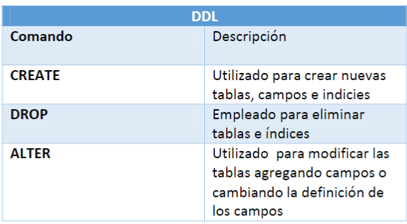

**Create** 
Este comando crea un *objeto* dentro de la base de datos, puede ser una base de datos o una tabla: 

```S
#Con el sisguiente comando creamos una base de datos: 
CREATE DATABASE cac2024; 

#con el siguiente comando se crea una tabla en la base de datos 
CREATE TABLE alumnos2024 
(
    nombre VARCHAR(25), 
    apellido VARCHAR(25), 
    edad INT, 
    curso VARCHAR(25)
)
``` 

**DROP** 
Este comando elimina un objeto de la base de datos. Puede ser una tabla o una base de datos: 

```s 
#Con el siguiente comando eliminamos la tabla "alumnos2024" 
DROP TABLE alumnos2024; 


``` 

**ALTER** 

Este comando permite modificar la estructura de un objeto. Se pueden agregar/quitar campos de una tabla o modificar el tipo de un campo. 

```s 
#Con el siguiente comando se agrega una columna a la base de datos "comision" del tipo INT. 

ALTER TABLE alumnos2024 ADD comision INT; 

#Con el siguiente comando se elimina un campo 
ALTER TABLE alumnos2024 DROP comision; 
``` 

## Lenguaje de manipulación de datos DML (*Data Manipulation Language*): 

Permite a los usuarios llevar a cabo las tareas de consulta o manipulación de datos, organizados por el modelo de datos adecuado 

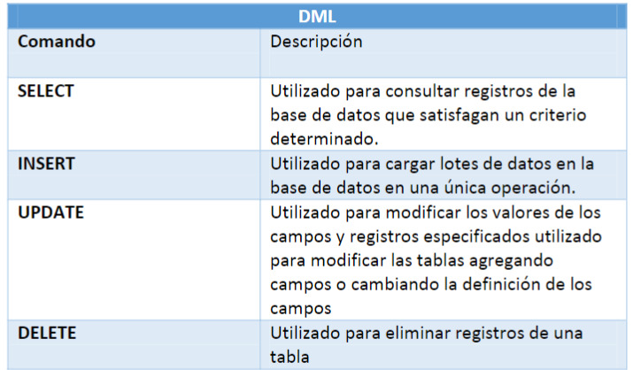 

**INSERT** 

Una sentencia INSERT agrega uno o más registros a una (y sólo una) tabla en una base de datos relacional. 

Ejemplo básico: 

`INSERT INTO alumnos2024(nombre, apellido, edad, curso) VALUES ('marcos', 'sanchez', '10', '2169')`; 

Las cantidades de columnas y valores deben ser iguales. Si una columna no se especifica, le será asignado el valor por omisión (por defecto). Los valores especificados por la sentencia *INSERT* deberán satisfacer todas las restricciones aplicables. Si ocurre un error de sintaxis o si alguna de las restricciones es violada, no se agregará la fila y devuelve ERROR. 

Ejemplo sin especificar campos: 

`INSERT INTO alumnos2024 VALUES('alejandro', 'gutierrez', '21', '2162');` 
 
**UPDATE** 

Se utiliza para modificar los valores de un conjunto de registros existentes en una tabla. 

Ejemplo: 

```s

#En el siguiente ejemplo, actualiza todos los campos de la tabla de comision  
UPDATE alumnos2024 SET curso='2164';

``` 

**DELETE** 

Una sentencia DELETE de SQL es utilizada para eliminar uno o más registros existentes en una tabla de una base de datos. 

```s 

#En el siguiente ejemplo, elimina todos los campos de la tabla comision 
DELETE FROM alumnos2024; 

``` 

Tanto para los comandos UPDATE y DELETE, se necesitan clausulas específicas para que no se actualicen o eliminen todos los registros. 

*Clausulas* 

Las clausulas son condiciones de modificación utilizadas para definir los datos que desea seleccionar o manipular  

[ejemplo clasulas parte 1](img/ejemplo-clausulas.PNG) 
[ejemplo clasulas parte 2](img/ejemplo-clausulas-2.PNG) 

## Operadores 

**Operadores lógicos**

[operadores lógicos](img/operadores-logicos.PNG) 

**Operadores comparacion** 

[operadores comparacion](img/operadores-comparacion.PNG) 


## Funciones 

Las funciones se usan dentro de una clausula SELECT en *grupos de registros* para devolver un único valor que se aplica a un grupo de registros 

|comando|descripcion|
|-------|-----------|

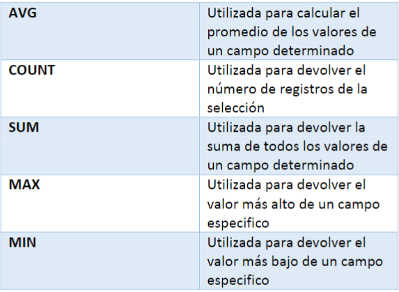 

## Consultas sentencia SELECT 

La sentencia *SELECT* "selecciona" los campos que conformaran la consulta, es decir, que establece los campos que se visualizaran o compondrán la consulta. 

El parámetro "listas_campo" está compuesto por uno o más nombres de los campos, separados por comas, pudiendose esoecificar también el nombre de la tabla a la cual pertenecen, seguido de un punto y del nombre del campo correspondiente.  

Si deseamos seleccionar todos los campos de una tabla, se puede utilizar el aterisco (*) para indicarlo: 

```s 
#Una consulta SELECT no se puede escribir sin la clausula FROM  
SELECT * FROM alumnos2024; 

SELECT nombre,apellido FROM alumnos2024;

#Una clausula es una extension que complementa a una sentencia
```

En este caso, la clausula FROM permite indicar en que tablas o en qué consultas (queries) se encuentran los campos especificados en las sentencias SELECT. 

## Clausula WHERE 

Esta clausula es opcional y permite seleccionar mediante una *condicion* que registros apareceran en la consulta (si no especifica, aparecen todos los registros). En la condicion comparamos el valor de un campo del registro con determinado valor, como por ejemplo: 

`SELECT * FROM alumnos2024 WHERE nombre = 'Agus'`; 

En este ejemplo, estamos seleccionando todos los campos de los registors dónde se cumpla la condicion.  

Podriamos también agregar más condiciones: 

`SELECT * FROM alumnos2024 WHERE nombre = 'Agus' OR nombre = 'Marcos';` 

Y acá seleccionariamos todos los registros dónde el nombre sea Agus o Marcos. 

Otros ejemplos: 

`SELECT * FROM alumnos2024 WHERE edad >=18;` 

`SELECT * FROM alumnos2024  WHERE edad>=18 AND edad<=45;` 
 

## Ordenar los registros: 

Mediante la clausla ORDER BY podemos organizar los registros obtenidos de la consulta de determinadas maneras 

`SELECT nombre FROM alumnos2024 ORDER BY nombre` 

También podemos ordenarlos de manera ascendente (manera por defecto) o descendente: 

`SELECT nombre, edad FROM alumnos2024 ORDER BY nombre DESC;` 

## Operador LIKE 

Se usa para comparar: 

`SELECT * FROM alumno2024 WHERE nombre LIKE 'al%';` 

(El % se usa para decir que no importa que haya más caracteres más allá de estos dos que estoy buscando)

Selecciona a todos los alumnos cuyo nombre comience con los caracteres 'al'.


`SELECT * FROM alumnos2024 WHERE apellidos LIKE ‘%ez';`
Selecciona los alumnos cuyos apellidos terminen con los caracteres 'ez'. 

`SELECT * FROM alumnos2024 WHERE apellidos LIKE ‘%zamo%'` 

Selecciona a todos los alumnos cuyo apellido contenga a los caracteres 'zamo'. 

## Eliminar registros especificos 

Para eliminar *registros* usamos el comando **DELETE** 

>`DELETE FROM alumnos2024;` 

Ejecutar el anterior comando borraria **todos** los registros de la tabla. Para eliminar uno o más registros, debemos indicar cuales son estos utilizando DELETE con la clausula WHERE con la cual establecemos la condicion que deben cumplir los registros a borrar.  

`DELETE FROM alumnos2024 WHERE nombre='Marcos';` 

## Actualizar registros específicos 

Para actualizar uno o varios datos de uno o varios registros usamos el query UPDATE. 

`UPDATE usuarios SET comision='2180'`
> En el ejemplo anterior actualizamos las comisiones de todos los registros de usuarios 

Para modificar registros en especificos usamos el condicional WHERE: 

`UPDATE alumnos2024 set comisión='2164' WHERE nombre='marcos';` 

> Si bien las condiciones no son obligatorias, si las omitimos la actualizacion afectara a todos los registros. 

También podemos actualizar varios campos en una sola instrucción: 

´UPDATE alumnos2024 SET nombre='miguel', comision='2168' WHERE nombre='marcos'´ 

> colocamos ambos campos más nuevo valor separados por coma 

## Trabajar con varias tablas (joins) 

**Constraints o restricciones**: Para asegurar la integridad de los datos almacenados en nuestras tablas, podemos crear restricciones, las cuales las podemos implementar al momento de crear las tablas o modificarlas: 

Las principales constraints que existen son: 
- PRIMARY KEY   <br>
 Esta es la restricción más común, ya que todas las tablas que creemos deben contener una (para poder hacerlas relacionales). Existen ciertos requerimientos para crearlas:

    - La columna utilizada para ser una primary key no puede aceptar valores NULL 
    - No se pueden repetir los valores en los registros , cada uno debe ser único 
    - Sólo puede existir una primary key por tabla


- UNIQUE <br> 
Esta constraint es muy paracedia a la primary key, pero con algunas diferencias: 
    - También genera un índice automatico 
    - La tabla puede contener más de una constraint UNIQUE 
    - Si puede aceptar un valor NULL, pero sólo un registro puede contenerlo ya que como su nombre lo indica, es de tipo único.
- FOREIGN KEY 
<br> Se forma de una columna o la combinación de varias columnas de una tabla que sirve como enlace hacía otra tabla. En esta última, los enlances son la o las columnas
que forman la primary key. Las columnas involucradas como llave foranea deben tener el mismo tipo de datos que la primary key de la tabla relacionada. Una llave foranea no crea un indice automaticamente, por lo que se recomienda generar uno para incrementar el rendimiento de las consultas: 

    - Los valores ingresados en la columna de la llave foranea, deben existir en la tabla a la que se hace referencia en la columna de la  primary key (tanto fk, que hace referencia a la pk de x tabla, deben coincidir en valor) 

    - Sólo se puede hacer referencia a las llaves primarias de tablas que se encuentren en la misma base de datos 

    - Sólo se puede hacer referencia a columnas de restricciones PRIMARY KEY o UNIQUE  


Para entender mejor estos conceptos, tomemos como referencia a ela siguiente tabla: 

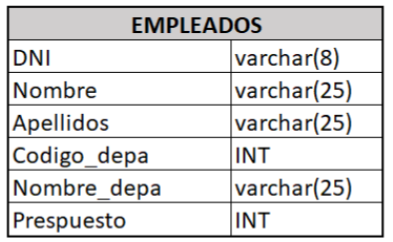

Los  datos de esta tabla podrian separarse en dos tablas, una "empleados" y otra "departamentos", de este modo, evitamos almacenar tantas veces los nombres los nombres de los departamentos en la tabla "empleados", así como también cometer errores de escritura al momento de ingresar el dato concreto. 

Ahora debemos pensar en dos conceptos para los campos, `PRIMARY KEY` y `FORAIGNE KEY`, ya que con identificar las mismas es que podremos crear las relaciones de las tablas y para ellos debemos utilizar los JOINS. 

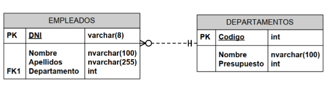 

<u>**Joins**</u>  

Los joins nos permite hacer uniones entre tablas y los resultados de consultas a ellas, lo cual nos va a permitir proveer cierta flexibilidad adicional, además de su sintaxis que es muy utlizada, también ganamos una mayor performance. 

**INNER JOIN**: Con esta sentencia sólo mostramos los registros que coinciden tanto en la tabla `A` como la `B`.  

**LEFT/RIGHT JOIN**: Estos JOINS excluyen resultados de una de las dos tablas, si hubiese campos que no coinciden podríuamos incluirlos mediante LEFT o RIGHT joins.  


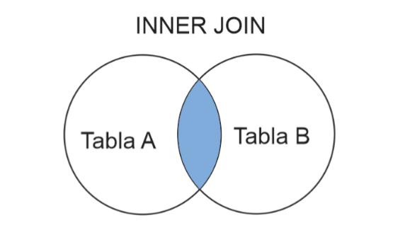


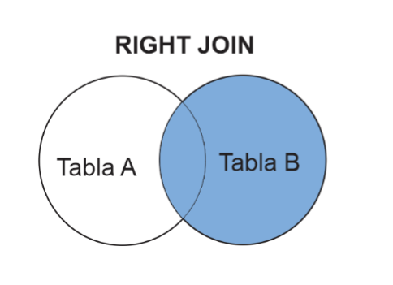 

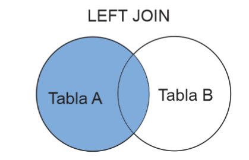

Ejemplo: 
`SELECT nombre, apellido FROM empleados INNER JOIN departamentos`


La relacion de estas tablas las logramos mediante las primary key (PK) de una tabla a relacionar con la foreign key (FK) de la tabla relacionada. 

La sintaxis del join no utiliza *WHERE*, sino que requiere la palabra *ON*. Ahí podemos añadir un filtro a tener en cuenta para realizar el cruce. 

Ejemplo: 
`SELECT nombre, apellido FROM empleados INNER JOIN departamentos ON empleados.departamento = departamento.codigo`
