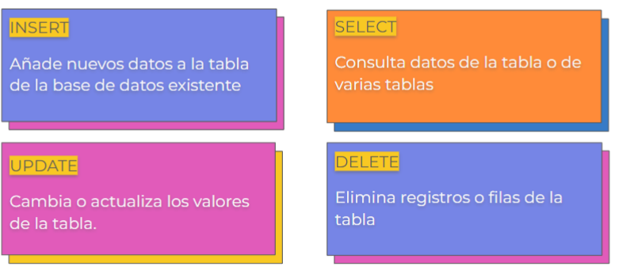
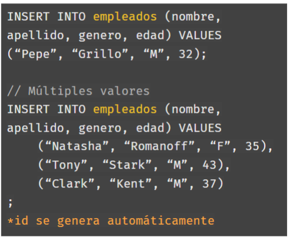
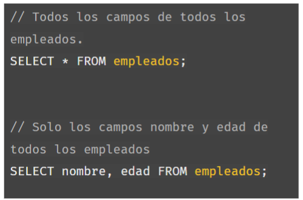
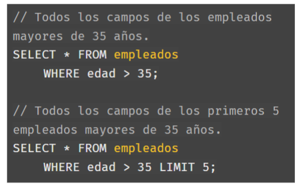
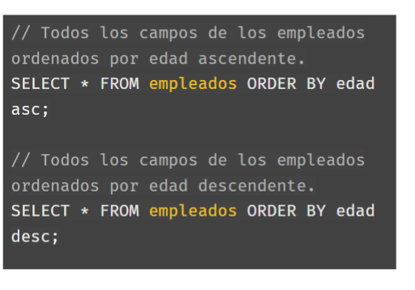
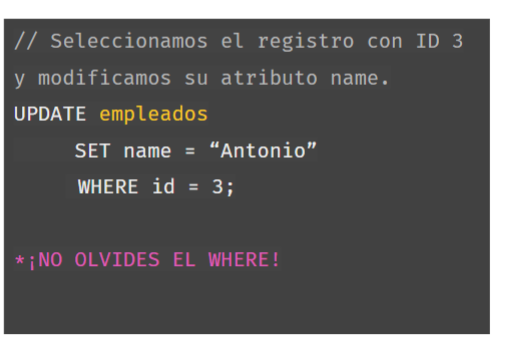
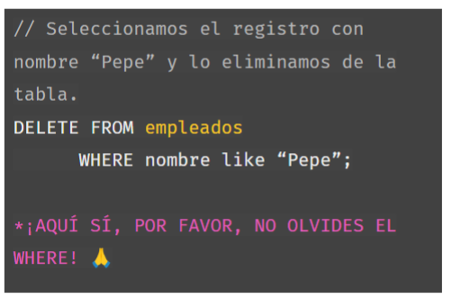
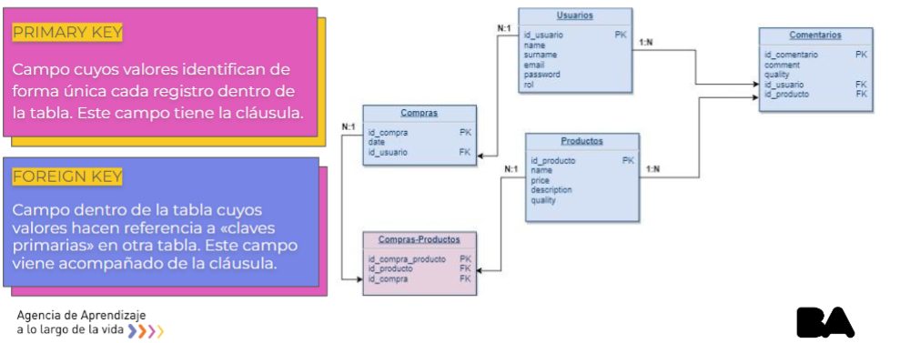
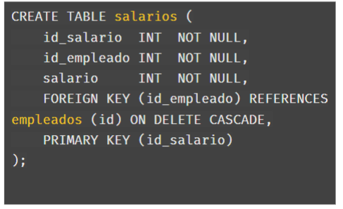
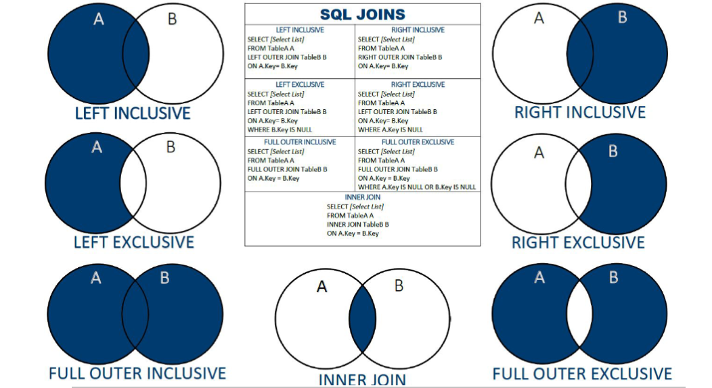

# Repaso 

En las clases estuvimos viendo como crear una base de datos, en esta unidad se ve más en detalle las relaciones, las sentencias DML y los INNER. 

## ¿Qué es DML?  
Al igual que el lenguale *DDL*, es un conjunto de palabras claves utilizadas para manipular la estructura que almacena los datos. Las sentencias *DML* se utilizan para **insertar**, **borrar**, **modificar**, y **consultar** los datos de una tabla. 

### Sentencias DML 

 

<u>**INSERT**</u> 
 
Este comando nos permite agregar registros a nuestras tablas. Es necesario indicar los campos que vamos a agregar y luego luego de la sentencia **VALUES** poner en el mismo orden los valores correspondientes a esos campos. También es posible agregar múltiples registros al mismo tiempo, separando cada declaración mediante una coma. 

 

<u>**SELECT**</u> 
 
Usamos a este comando para consultar los datos de una tabla trayendo sólo los valores solicitados dependiendo de la consulta realizada. Con `*` traemos todos los valores y regsistros de la tabla seleccionada (*FROM* tabla). También podemos traer sólo algunos campos, indicandolos antes del *FROM* y separados por coma. 

 

Otra forma muy útil es colocar una sentencia *WHERE* para generar una condicion a cumplir y de esa manera filtrar el resultado. Asimismo, con la sentencia *LIMIT* podemos limitar la cantidad de registros obtenidos. 

 

Por otra parte, *SQL* nos brinda la posibilidad de traer los datos de forma ordenada. Ese ordenamiento puede ser de forma ascendente o descendente.  

 

<u>**UPDATE**</u>
 
Mediante esta sentencia podemos actualizar los atributos de nuestros registros. Es importante asignarle un nuevo valor al atributo seleccionado mediante un *SET*. 

Si no usamos la sentencia *WHERE* cambiaremos el nombre de TODOS los registros, por eso es importante no olvidarlo. 

 
<u>**DELETE**</u>: 
 
Esta es la sentencia más conflictiva, ya que puede causar muchos errores irreparables para principiantes y no tanto. La sentencia *DELETE* al igual que la anterior *UPDATE*, necesita un *WHERE* para saber que registro eliminar. Si no la incluimos entonces se borran ***TODOS* los registros de la tabla**. 

 
## Relaciones en SQL 

Que dos tablas estén relacionadas nos permiten seleccionar datos de varias tablas en una misma consulta. 

### Tipos de relaciones: 

Las base de datos relacionales tienen diversos *"tipos de relaciones"* utilizadas paraq vincular nuestras tablas. Este "vinculo" depende de la cantidad de ocurrencias que tiene un registro de una tabla dentro de otra tabla (esto se conoce como cardinalidad). 

<u>**Uno a uno - 1:1**</u> 
 
Cuando un *registro* de una tabla sólo está **relacionado** con un registro de *otra tabla*, y viceversa.  

<u>**Uno a muchos / muchos a uno - 1:N - N:1**</u>:
 
Una relación de 1 a 'n' existe cuando un *registro* de la tabla A está relacionado con *ninguno* o *muchos* registros de la tabla B, pero este registro en la tabla B sólo está relacionado con un registro de la tabla A.  

<u>**muchos a muchos - N:N**</u>: 
Cuando muchos registros de una tabla se relacionan con muchos registros de otra tabla. Veamoslo con un ejemplo. 

(El ejemplo es el de alumno y universidad) 

## Claves primarias y Foraneas 
Para que una relación entre dos tablas exista, la tabla que deseamos relacionar debe poseer una PK, mientras que la tabla dónde estará el lado depedendiente de la relación debe poseer una clave foranea. 

 

(osea la tabla dependiente de la relaciom va a tener una fk, que apunta a la clave primaria de la tabla a relacionar. 
En el ejemplo podemos ver como muchas compras pueden pertener a un usuario, por lo que consta con dos campos, uno es el ID de la compra única realizada, y el otro es una FK que apunta al id del usuario que realizó la compra) 

### Ejemplo de relaciones 

A nuestra base de datos le agregamos una tabla "salarios", que va a estar relaionada a la tabla de empleados en un tipo de uno a muchos, es decir, muchos empleados poseen un salario. 

Nuestra tabla posee un `id_salario` que funciona como *PK* de cada registro y un campo `id_empleado` que funciona como *FK* que apunta al ID de un empleado en esa tabla. 

Las palabras `ON DELETE CASCADE`, indican que si se elimina un empleado de la tabla, debe eliminarse el registro de salario relacionado a ese empleado. 

  

## JOINS 
Es una de las sentencias que nos permiten concatenar en una sola consulta datos relacionados de diferentes tablas 

//<u>****</u>
 