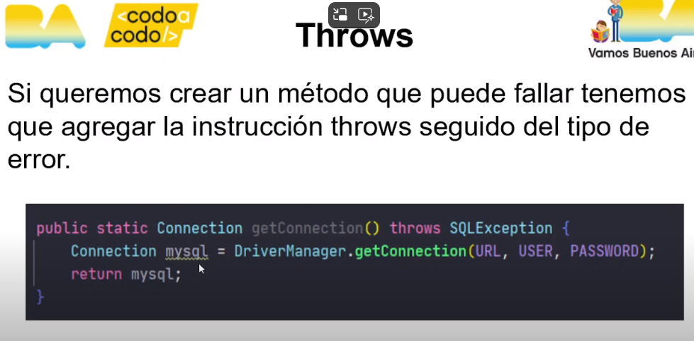

## JDBC 

Es una API que permite la ejecucion de operaciones sobre bases de datos desde Java, independientemente del sistema operativo donde se ejecute o de la base de datos a la cual se accede, utilizando el lenguaje SQL del modelo de bases de datos que se utilice 

## Conexion 

Necesitamos usar el método getConnection que nos devuelve un objeto del tipo Connection 

`Connection nombre = DriverManager.getConnection(url, user, password);` 

- URL: "jdbc:mysql://localhost:3306/dbName"


## try - catch 
```Java
try {
			DriverManager.getConnection(URL, USER, PASSWORD);
			System.out.println("Conección establecida/");
			
		} catch (SQLException e) {
			// TODO Auto-generated catch block
			System.out.println("Ocurrio un error :(");
			e.printStackTrace();
		};
}
```
## throws 



... 

## Satement 

Necesitamos un lugar para hacer las consultas, un objeto. Para eso, usamos el método `createStatement` del objeto connection que creamos, *este nos devuelve un objeto del tipo Statement*. Este objeto sirve para procesar una sentencia SQL y procesar los resultados de esta.  

A estas, podemos escribirlas como Strings y pasarlas como argumento alos métodos de Statement. 

- executeQuery(query): Para consultas con select 
- executeUpdate(query): Para consultas con Update, Insert y Delete. 

### Result Set 

El objeto `ResultSet` proporciona varios métodos para obtener los datos de columnas correspondinetes a una fila, *contiene los resultados de una consulta SQL*. 

- next(): devuelve un booleano que indica si la fila que sigue es valida. 
- get(): devuelve el valor que pedimos, antes de los () va el tipo  dato. 

Ambos métodos reciben como parametro el nombre del campo. 

### Prepared Statement 

En lugar de crear un Statement podemos crear un ***PreparedStatement*** para crear consultas *con parametros*. Vamos a usar un signo de pregunta para definir los parámetros antes de hacer la consulta.

